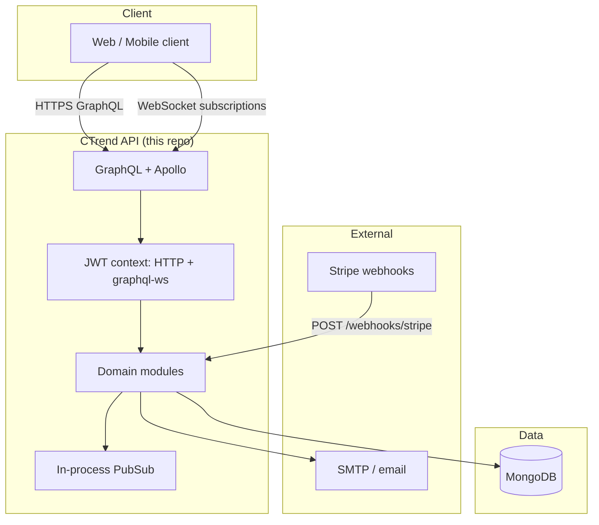

# CTrend

**Social comparison voting platform** — users create side-by-side posts, vote on options, follow others, and discover content through a scoped, sortable feed. This repository is the **production API**: **NestJS + GraphQL (code-first) + MongoDB**.

| | Link |
|---|------|
| **Live app (frontend)** | [https://c-trend.vercel.app/](https://c-trend.vercel.app/) |
| **API** | Deploy separately (e.g. Render); GraphQL endpoint is configured per environment |

> The Vercel URL is the user-facing client. This repo powers the backend: auth, posts, votes, comments, feed, orgs, billing webhooks, and real-time subscriptions.

---

## Why this project (for reviewers)

CTrend is a **full product-shaped backend**: not a CRUD demo. It combines **GraphQL**, **role-based access**, **complex MongoDB feed queries**, **subscriptions**, **third-party billing**, and **email flows** in one coherent domain model. The codebase is structured so each bounded context lives in its own Nest module with clear boundaries.

---

## Architecture (high level)



### Module map (domain-driven layout)

| Path | Responsibility |
|------|----------------|
| `src/auth/` | JWT, Google OAuth, register/login |
| `src/users/` | Profiles, interests, `toGql()` serialization |
| `src/posts/` | Post creation (user / org / system), serialization, saves, reactions |
| `src/votes/` | Cast / change votes, stats, anonymous flag, voter listing |
| `src/comments/` | Threaded comments, comment likes |
| `src/feed/` | Global vs personalized feed + sort (trending / latest / admin priority) |
| `src/categories/` | Categories referenced by posts |
| `src/organizations/` | Org profiles, ownership, global post quota |
| `src/follows/` | Follow graph → feed personalization |
| `src/billing/` | Stripe checkout + webhook lifecycle |
| `src/mail/` | Transactional email (verification, password reset) |
| `src/seed/` | Dev-only seed data |

---

## How the application runs (request path)

1. **Bootstrap** — `main.ts` creates the Nest app, applies global validation / CORS, and listens on `PORT` (default **4000**).
2. **GraphQL** — `GraphQLModule` (in `app.module.ts`) uses the **Apollo driver**, **code-first** schema, and writes the generated schema to `src/schema.gql` at startup.
3. **Context & auth** — JWT is resolved **once per request** in the GraphQL `context` factory (not duplicated in every resolver):
   - HTTP: `Authorization: Bearer <token>`
   - Subscriptions (`graphql-ws`): same token via `connectionParams`
   - Valid tokens attach `req.user` (`id`, `role`, `email`, `username`, `interests`).
4. **Guards** — `GqlAuthGuard`, `OptionalJwtGqlGuard`, `RolesGuard`, and `GqlThrottlerGuard` (global throttle: **120 req / 60s**) enforce access and abuse protection.
5. **Resolvers → Services** — Resolvers stay thin; business rules live in injectable services with Mongoose models.
6. **Real-time** — `src/pubsub.ts` exports a single in-process `PubSub` for `NEW_POST`, `POST_VOTE_UPDATED`, and vote streams. Multi-instance production would swap this for Redis-backed pub/sub.

---

## Hardest / most interesting engineering (showcase)

These are the areas that required the most design and care — good talking points in interviews.

### 1. Personalized feed as a composable MongoDB filter

`FeedService.buildFilter()` constructs visibility-safe **`$or`** conditions: global public content, the viewer’s own posts, interest-matched categories, private posts from followed users, and org reach (connected vs global). Wrong logic leaks private posts or drops legitimate content; getting the **$or** branches and indexes right was the core challenge.

### 2. Single auth story for HTTP queries and WebSocket subscriptions

Subscriptions do not carry the same headers as HTTP. Unifying **Bearer JWT** from headers *and* `connectionParams`, then hydrating `req.user` in one place, avoids duplicated verification logic and keeps guards consistent across queries, mutations, and subscriptions.

### 3. Organization “global reach” with a monthly cap

Premium orgs can post with **global** reach up to a **monthly quota** (`posts.service.ts` + org counters). This mixes **business rules**, **subscription state**, and **date-bucketed counters** — easy to get wrong under race conditions; the code paths are explicit and validated.

### 4. Voting model: change vote, anonymous voters, “recent” ordering

Votes are **one document per user per post** (unique index). Changing an option updates the same row (so totals stay correct). Voter lists sort by **`updatedAt`** so a changed vote surfaces as **recent** activity. Anonymous votes hide user identity in listings while still counting in aggregates.

### 5. Engagement layer on top of core posts

Post-level **likes / hype**, **saves (“keep”)**, **comment counts**, **recent comments**, and **comment likes** are modeled as separate collections with indexes — avoids bloating the post document and keeps counts queryable.

### 6. Stripe billing + idempotent webhooks

Checkout and subscription lifecycle are integrated with **signature-verified** webhooks (`checkout.session.completed`, invoices, cancellation). Lazy Stripe initialization avoids hard failures when keys are absent in dev.

### 7. Email UX in constrained clients

Verification emails use HTML tuned for real clients (including pragmatic clipboard behavior where JS is blocked).

---

## Tech stack

- **Runtime:** Node.js **20.x**
- **Framework:** NestJS **10**
- **API:** GraphQL (Apollo Server **5**), code-first schema
- **Database:** MongoDB via Mongoose **9**
- **Auth:** JWT, Passport, Google token verification
- **Real-time:** `graphql-ws`, in-memory `graphql-subscriptions` PubSub
- **Payments:** Stripe
- **Mail:** Nodemailer (SMTP) with branded HTML templates
- **Quality:** ESLint, Prettier, Jest

---

## Local development

```bash
npm install
cp .env.example .env   # then fill values
npm run start:dev      # http://localhost:4000/graphql (playground when not production)
```

### Useful commands

| Command | Purpose |
|---------|---------|
| `npm run build` | Compile to `dist/` |
| `npm run start:prod` | Run `node dist/main` |
| `npm test` | Unit tests (`src/**/*.spec.ts`) |
| `npm run test:e2e` | E2E tests |
| `npm run lint` | ESLint |
| `npm run format` | Prettier |

---

## Environment variables

Required / important variables (see also `CLAUDE.md` in repo):

| Variable | Purpose |
|----------|---------|
| `MONGODB_URI` | MongoDB connection string |
| `JWT_SECRET` | Signing secret for access tokens |
| `GOOGLE_CLIENT_ID` | Optional — Google sign-in |
| `STRIPE_SECRET_KEY` / `STRIPE_WEBHOOK_SECRET` | Optional — billing + webhook verification |
| `FRONTEND_URL` | Redirect URLs (e.g. Stripe return) |
| `CORS_ORIGIN` | Comma-separated allowed origins |
| `PORT` | Default **4000** |
| `NODE_ENV` | `production` disables GraphQL playground |

SMTP variables are documented for email (`SMTP_HOST`, `SMTP_USER`, `SMTP_PASS`, etc.).

---

## API documentation for frontend

- **`docs/frontend-post-engagement-api.md`** — engagement fields, saves, reactions, comment likes, voters, anonymous votes, and GraphQL examples.

Do **not** hand-edit `src/schema.gql` for schema changes — it is regenerated from decorators at startup.

---

## Deployment & CI

- **CI:** `.github/workflows/ci.yml` — install, build, test on PR/push to `main`
- **Deploy hook:** `.github/workflows/deploy-render.yml` — optional Render deploy (secret: `RENDER_DEPLOY_HOOK_URL`)
- **Render:** `render.yaml` blueprint

Frontend (Vercel) and API (Render or similar) are typically **separate services**; point the client at your deployed GraphQL URL and CORS origins.

---

## Repository layout (quick reference)

```
src/
  app.module.ts          # GraphQL + Mongo + throttle + module graph
  main.ts                # HTTP bootstrap
  pubsub.ts              # Subscription event hub
  */                     # One Nest module per domain (posts, votes, …)
docs/
  frontend-post-engagement-api.md
```

---

## License

`UNLICENSED` (private / personal project — adjust if you open-source).

---

**Summary for interviewers:** CTrend demonstrates **production-style API design** — clear module boundaries, shared GraphQL auth context, non-trivial feed authorization, subscriptions, payments, and engagement features — with a live client at **[https://c-trend.vercel.app/](https://c-trend.vercel.app/)** backed by this API.
