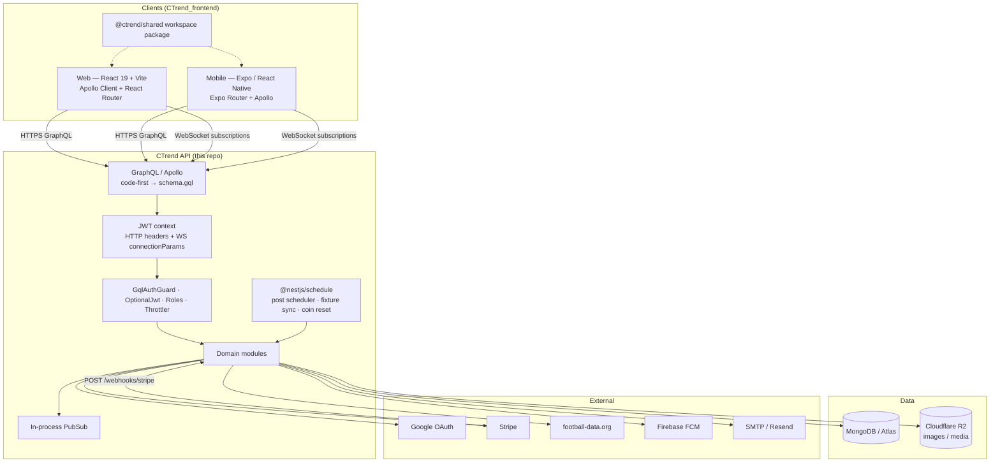

# CTrend

**Social comparison voting platform** — users create side-by-side posts, vote on options, follow others, chat, earn coins, and discover content through a scoped, sortable feed. This repository is the **production API**: **NestJS + GraphQL (code-first) + MongoDB**.

| | Link |
|---|------|
| **Live app (web)** | [https://c-trend.vercel.app/](https://c-trend.vercel.app/) |
| **Companion frontend** | Separate repo (`CTrend_frontend`) — Vite web + Expo mobile |
| **API** | Deployed separately (e.g. DigitalOcean App Platform); GraphQL URL is configured per client environment |

> The Vercel / mobile clients are the user-facing apps. This repo powers auth, posts, votes, comments, feed, messaging, notifications, campaigns (incl. World Cup), coins, billing webhooks, uploads, and real-time subscriptions.

---

## Why this project (for reviewers)

CTrend is a **full product-shaped backend**: not a CRUD demo. It combines **GraphQL**, **role-based access**, **complex MongoDB feed queries**, **subscriptions**, **third-party billing**, **media uploads**, **push notifications**, **campaign prize draws**, and **email flows** in one coherent domain model. Each bounded context lives in its own Nest module with clear boundaries.

---

## Full system architecture

CTrend is a **three-tier product**: one GraphQL API, one web client, one native mobile client. Both clients speak the same GraphQL schema over HTTP + `graphql-ws`.


```mermaid
flowchart TB
  subgraph Clients["Clients (CTrend_frontend)"]
    WEB["Web — React 19 + Vite<br/>Apollo Client + React Router"]
    MOB["Mobile — Expo / React Native<br/>Expo Router + Apollo"]
    SHARED["@ctrend/shared workspace package"]
  end

  subgraph API["CTrend API (this repo)"]
    GQL["GraphQL / Apollo<br/>code-first → schema.gql"]
    CTX["JWT context<br/>HTTP headers + WS connectionParams"]
    GUARDS["GqlAuthGuard · OptionalJwt · Roles · Throttler"]
    MOD["Domain modules"]
    CRON["@nestjs/schedule<br/>post scheduler · fixture sync · coin reset"]
    PS["In-process PubSub"]
    GQL --> CTX --> GUARDS --> MOD
    MOD --> PS
    CRON --> MOD
  end

  subgraph Data
    MDB[(MongoDB / Atlas)]
    R2[(Cloudflare R2<br/>images / media)]
  end

  subgraph External
    GOOGLE[Google OAuth]
    STRIPE[Stripe]
    FD[football-data.org]
    FCM[Firebase FCM]
    SMTP[SMTP / Resend]
  end

  WEB -->|HTTPS GraphQL| GQL
  MOB -->|HTTPS GraphQL| GQL
  WEB -->|WebSocket subscriptions| GQL
  MOB -->|WebSocket subscriptions| GQL
  SHARED -.-> WEB
  SHARED -.-> MOB

  MOD --> MDB
  MOD --> R2
  MOD --> GOOGLE
  MOD --> STRIPE
  MOD --> FD
  MOD --> FCM
  MOD --> SMTP
  STRIPE -->|POST /webhooks/stripe| MOD
```

### Repository roles

| Repo | Role | Stack | Deploy |
|------|------|-------|--------|
| **CTrend** (this) | GraphQL API + Stripe webhook + upload REST | NestJS 10, Apollo 5, Mongoose 9, MongoDB | DigitalOcean App Platform |
| **CTrend_frontend** `src/` | Web SPA | React 19, Vite, Apollo, React Router 7 | Vercel |
| **CTrend_frontend** `mobile/` | Native Android (Expo) | React Native 0.85, Expo Router, Apollo | EAS / Play Store |
| **CTrend_frontend** `packages/shared` | Shared types / helpers | TypeScript workspace package | Consumed by web + mobile |

---

## Backend architecture (this repo)

### Request path

1. **Bootstrap** — `main.ts` creates the Nest app, applies global validation / CORS, listens on `PORT` (default **4000**).
2. **GraphQL** — `GraphQLModule` in `app.module.ts` uses the **Apollo driver**, **code-first** schema, writes `src/schema.gql` at startup.
3. **Context & auth** — JWT is resolved **once per request** in the GraphQL `context` factory:
   - HTTP: `Authorization: Bearer <token>`
   - Subscriptions (`graphql-ws`): same token via `connectionParams` (also back-filled onto `req.headers` for Passport)
   - Valid tokens attach `req.user` (`id`, `role`, `roles`, `email`, `username`, `interests`)
   - WS connect/disconnect also drives **presence** (`PresenceService`)
4. **Guards** — `GqlAuthGuard`, `OptionalJwtGqlGuard`, `RolesGuard`, global `GqlThrottlerGuard` (**120 req / 60s**)
5. **Resolvers → Services** — thin resolvers; business rules in injectable services + Mongoose models
6. **Real-time** — `src/pubsub.ts` in-process `PubSub` (swap to Redis for multi-instance)
7. **REST side doors** — `POST /webhooks/stripe`; uploads controller for multipart / signed R2 flows

### Module map

#### Core social

| Path | Responsibility |
|------|----------------|
| `src/auth/` | JWT, Google OAuth, register / login / password reset |
| `src/users/` | Profiles, interests, roles, sound prefs, `toGql()` |
| `src/posts/` | User / org / system posts, scheduling, saves, emoji reactions, `toGql()` + live vote stats |
| `src/votes/` | Cast / change votes, anonymous flag, stats, voter listing |
| `src/comments/` | Threaded comments, likes / reactions |
| `src/feed/` | Global vs personalized feed + sort (`LATEST` / `TRENDING` / `ADMIN_PRIORITY`) |
| `src/categories/` | Categories referenced by posts |
| `src/follows/` | Follow graph → feed personalization + friends UX |
| `src/organizations/` | Org profiles, ownership, monthly global-post quota |
| `src/search/` | User / post search |

#### Engagement & growth

| Path | Responsibility |
|------|----------------|
| `src/coins/` | Engagement ledger, streaks, monthly leaderboard + podium reset cron |
| `src/invitations/` | Invite / accept flows |
| `src/promotion-tokens/` | Role-promotion token reject / accept |
| `src/notifications/` | In-app notification records + `NEW_NOTIFICATION` subscription |
| `src/push/` | Firebase Cloud Messaging (optional; needs service account) |
| `src/messages/` | Conversations, DMs, reactions, typing, admin/moderator threads |
| `src/presence/` | Online/offline from WS connect/disconnect |
| `src/content-reports/` | User reports for moderation |
| `src/admin-analytics/` | Admin dashboards / analytics queries |
| `src/platform-settings/` | Feature flags, Android min-version enforcement plugin |
| `src/account-deletion/` | Account deletion cleanup |

#### Campaigns & sports

| Path | Responsibility |
|------|----------------|
| `src/campaigns/` | Generic promotional campaigns (banners, CTA, prize metadata) |
| `src/fixtures/` | World Cup fixtures sync (football-data.org), auto schedule campaign posts |
| `src/world-cup-campaign/` | Match campaign posts, result processing, random prize winner draw |
| `src/match-predictions/` | User match predictions + live updates |

#### Platform services

| Path | Responsibility |
|------|----------------|
| `src/billing/` | Stripe checkout + signature-verified webhooks |
| `src/uploads/` | Cloudflare R2 (S3-compatible) image upload / signed URLs |
| `src/mail/` | Transactional email (verification, password reset) |
| `src/seed/` | Dev-only dummy posts / campaign seed |
| `src/common/` | Enums, guards, decorators, mentions, Android version plugin |

### Post types & visibility

Defined in `src/common/enums.ts`:

| Type | Who creates | Visibility / reach |
|------|-------------|-------------------|
| `USER` | Regular users | `PUBLIC` or `PRIVATE` |
| `ORG` | Organizations | `CONNECTED` (free) or `GLOBAL` (premium, monthly cap) |
| `SYSTEM` | Admin | Highest feed priority (`feedPriority: 100`); likes often disabled |

### Feed logic (`src/feed/feed.service.ts`)

`buildFilter()` builds a MongoDB `$or` from scope:

- **GLOBAL** — system posts + public user posts + global org posts
- **PERSONALIZED** — adds viewer’s own posts, interest-matched categories, private posts from followed users, connected org posts from followed org owners

Sort: `LATEST` (`createdAt`), `TRENDING` (`voteCount` + `createdAt`), `ADMIN_PRIORITY` (`feedPriority` + `voteCount` + `createdAt`).

### Real-time subscription events (`src/pubsub.ts`)

| Event | When |
|-------|------|
| `NEW_POST` / `POST_UPDATED` / `POST_DELETED` | Post lifecycle |
| `POST_VOTE_UPDATED` / `VOTE_UPDATED` | Vote cast or voting window change |
| `NEW_MESSAGE` / `MESSAGE_READ` / `MESSAGE_REACTION_CHANGED` / `MESSAGE_DELETED` / `TYPING_INDICATOR` | Messaging |
| `ADMIN_MODERATOR_USER_MESSAGE` | Admin ↔ user support threads |
| `USER_PRESENCE_CHANGED` | Online / offline |
| `NEW_NOTIFICATION` | In-app notification created |
| `MATCH_PREDICTION_UPDATED` | Prediction tallies change |

### Campaign system

**Generic campaigns** (`src/campaigns/`): `name`, `slug`, `bannerText`, `ctaUrl`, `isActive`, prize fields, date window. Clients query `activeCampaigns` and render feed banners.

**World Cup Fever** (`src/fixtures/` + `src/world-cup-campaign/`):

1. `FixturesAutoScheduleService` syncs WC matches from football-data.org (startup + every 4h) and schedules SYSTEM campaign posts **24h before kickoff**.
2. Voting closes at kickoff (`votingEndsAt`).
3. `processMatchResult` fetches final score, picks winning option, randomly selects one non-anonymous correct voter → `CampaignWinner` (idempotent; draws = no winner).

Disable auto import with `DISABLE_WC_FIXTURE_AUTO_IMPORT=true`.

### Scheduled jobs

| Job | Module | Cadence |
|-----|--------|---------|
| Publish scheduled posts | `PostSchedulerService` | ~every minute |
| Sync WC fixtures + auto-create posts | `FixturesAutoScheduleService` | startup + ~4h |
| Monthly coin podium reset | `CoinsMonthlyResetService` | monthly UTC boundary |

---

## Frontend architecture (companion repo)

Path: `CTrend_frontend` (not in this repo). Both surfaces share one GraphQL contract with this API.

### Web (`src/`)

```
src/
  pages/          # Route screens (Feed, Post, Profile, World Cup, Admin, …)
  components/     # FeedPostCard, MessengerPanel, CampaignBanners, …
  context/        # Auth, Coins, Messenger, Notifications, SoundPreferences
  graphql/        # Apollo documents grouped by domain
  layouts/        # AppShell (top bar + bottom nav)
  lib/            # apolloClient, authStorage, mapGqlPostToFeedView, …
  hooks/          # Mentions, notifications, coin rank
  types/          # Feed view models
```

**Client plumbing**

- Apollo split link: queries/mutations → `VITE_GRAPHQL_HTTP`; subscriptions → `VITE_GRAPHQL_WS`
- JWT from `localStorage` (`authStorage`) injected on HTTP headers and WS `connectionParams`
- Cache persistence via `apollo3-cache-persist`
- Optimistic votes in `FeedPostCard`; live corrections via `POST_VOTE_UPDATED`
- Guest-friendly feed; `ProtectedRoute` / `AdminRoute` for gated pages

**Primary routes**

| Route | Page |
|-------|------|
| `/` | Feed (+ campaign banners) |
| `/post/:postId` | Post detail + comments + voters |
| `/create` | Create comparison post |
| `/friends` | Follows / friend requests |
| `/world-cup/*` | Fixtures, results, standings, stats, road map |
| `/world-cup/match/:id` | Match detail + prediction |
| `/campaign/:slug` | Campaign detail |
| `/coins`, `/points` | Leaderboards |
| `/notifications` | Notification center |
| `/admin` | Campaigns, World Cup tools, reports, analytics |
| `/login`, `/signup`, … | Auth + legal pages |

### Mobile (`mobile/`)

Expo Router app under `mobile/app/` (tabs, chat, world-cup, coins, admin, …). Same GraphQL operations via `EXPO_PUBLIC_GRAPHQL_HTTP` / `_WS`. Optional FCM push; Android version gate enforced by API plugin + `platform-settings`.

### Client ↔ API mapping (examples)

| Frontend concern | Backend module |
|------------------|----------------|
| Feed + vote UI | `feed`, `votes`, `posts` |
| Comments / reactions | `comments`, `posts` |
| Friends | `follows` |
| Messenger panel / chat | `messages`, `presence` |
| Notification bell | `notifications`, `push` |
| Campaign banners / WC pages | `campaigns`, `fixtures`, `world-cup-campaign`, `match-predictions` |
| Coins / podium | `coins` |
| Image upload | `uploads` → R2 |
| Admin tabs | `campaigns`, `world-cup-campaign`, `content-reports`, `admin-analytics`, `messages` |

---

## Hardest / most interesting engineering

### 1. Personalized feed as a composable MongoDB filter

`FeedService.buildFilter()` constructs visibility-safe `$or` branches. Wrong logic leaks private posts or drops legitimate content.

### 2. Single auth story for HTTP and WebSocket

Bearer JWT from headers *and* `connectionParams`, hydrated once into `req.user`, keeps guards consistent across queries, mutations, and subscriptions. Presence hooks into the same WS lifecycle.

### 3. Organization global reach with a monthly cap

Premium orgs post with **global** reach up to a **monthly quota** — business rules + subscription state + date-bucketed counters.

### 4. Voting model

One vote document per user per post (unique index). Changing option updates the same row; voter lists sort by `updatedAt` so a changed vote surfaces as recent. Anonymous votes hide identity but still count.

### 5. World Cup campaign pipeline

Fixture sync → scheduled SYSTEM posts → kickoff closes voting → score fetch → fair random winner among correct non-anonymous voters — idempotent admin processing.

### 6. Stripe billing + idempotent webhooks

Signature-verified lifecycle (`checkout.session.completed`, invoices, cancellation). Lazy Stripe init so missing keys do not crash local/dev.

### 7. Media via Cloudflare R2

S3-compatible uploads with public URL serving; keeps binary data out of MongoDB.

---

## Tech stack

| Layer | Choices |
|-------|---------|
| **API runtime** | Node.js **20.x**, NestJS **10** |
| **API surface** | GraphQL (Apollo Server **5**), code-first |
| **DB** | MongoDB via Mongoose **9** |
| **Auth** | JWT, Passport, Google token verification |
| **Real-time** | `graphql-ws`, in-memory `graphql-subscriptions` |
| **Jobs** | `@nestjs/schedule` |
| **Payments** | Stripe |
| **Media** | Cloudflare R2 (`@aws-sdk/client-s3`) |
| **Push** | Firebase Admin (optional) |
| **Mail** | Nodemailer / Resend |
| **Sports data** | football-data.org |
| **Web client** | React 19, Vite 6, Apollo Client 3, React Router 7 |
| **Mobile client** | Expo ~56, React Native 0.85 |
| **Quality** | ESLint, Prettier, Jest |

---

## Local development

```bash
npm install
cp .env.example .env   # then fill values
npm run start:dev      # http://localhost:4000/graphql (playground when not production)
```

Point the frontend at this API:

```bash
# in CTrend_frontend
VITE_GRAPHQL_HTTP=http://localhost:4000/graphql
VITE_GRAPHQL_WS=ws://localhost:4000/graphql
npm run local   # or npm run dev
```

### Useful commands

| Command | Purpose |
|---------|---------|
| `npm run build` | Compile to `dist/` |
| `npm run start:prod` | Run `node dist/main.js` |
| `npm test` | Unit tests (`src/**/*.spec.ts`) |
| `npm run test:e2e` | E2E tests |
| `npm run lint` | ESLint |
| `npm run format` | Prettier |

---

## Environment variables

| Variable | Purpose |
|----------|---------|
| `MONGODB_URI` | MongoDB connection string |
| `JWT_SECRET` / `JWT_EXPIRES_IN` | Access token signing |
| `GOOGLE_CLIENT_ID` | Optional — Google sign-in |
| `STRIPE_SECRET_KEY` / `STRIPE_WEBHOOK_SECRET` | Optional — billing + webhook verification |
| `FRONTEND_URL` | Redirect URLs (Stripe, email links) |
| `CORS_ORIGIN` | Comma-separated allowed origins |
| `PORT` | Default **4000** |
| `NODE_ENV` | `production` disables GraphQL playground |
| `FOOTBALL_DATA_API_KEY` | World Cup fixture sync |
| `CLOUDFLARE_ACCOUNT_ID` / `R2_*` | Optional — media uploads |
| `FIREBASE_SERVICE_ACCOUNT` | Optional — FCM push (JSON or base64) |
| `DISABLE_WC_FIXTURE_AUTO_IMPORT` | Skip WC auto sync |
| `DISABLE_POST_SCHEDULER` | Skip scheduled-post cron |

SMTP / Resend variables are used for transactional email. See `.env.example` and `CLAUDE.md`.

---

## API documentation for clients

- **`docs/frontend-post-engagement-api.md`** — engagement fields, saves, reactions, comment likes, voters, anonymous votes
- **`docs/firebase-android-setup.md`** — Android Firebase / Google services setup

Do **not** hand-edit `src/schema.gql` — it is regenerated from decorators at startup.

---

## Deployment & CI

- **CI:** `.github/workflows/ci.yml` — install, build, test on PR/push to `main`
- **Deploy:** `.github/workflows/deploy-digitalocean.yml` — after build + tests runs `doctl apps create-deployment` (does **not** re-apply `.do/app.yaml`), so secrets stay in the **DigitalOcean Dashboard**. GitHub secrets: `DIGITALOCEAN_ACCESS_TOKEN`, `DIGITALOCEAN_APP_ID`
- **Bootstrap spec:** `.do/app.yaml` — reference for creating/importing the app once

Web (Vercel) and this API are **separate services**; point clients at the deployed GraphQL URL and set `CORS_ORIGIN` accordingly.

---

## Repository layout (quick reference)

```
src/
  app.module.ts              # GraphQL + Mongo + throttle + module graph
  main.ts                    # HTTP bootstrap
  pubsub.ts                  # Subscription event hub
  auth/ users/ posts/ …      # One Nest module per domain
  campaigns/ fixtures/       # Promo + World Cup
  world-cup-campaign/
  messages/ notifications/   # Real-time social
  coins/ uploads/ billing/
.do/
  app.yaml                   # DigitalOcean App Platform spec
docs/
  frontend-post-engagement-api.md
  firebase-android-setup.md
```

---

## License

`UNLICENSED` (private / personal project — adjust if you open-source).

---

**Summary for interviewers:** CTrend demonstrates **production-style full-stack design** — Nest module boundaries, shared GraphQL auth for HTTP + WS, non-trivial feed authorization, messaging & presence, campaigns with automated prize draws, coins/leaderboards, R2 media, Stripe webhooks, and dual clients (Vite web + Expo mobile) against one live API at **[https://c-trend.vercel.app/](https://c-trend.vercel.app/)**.
